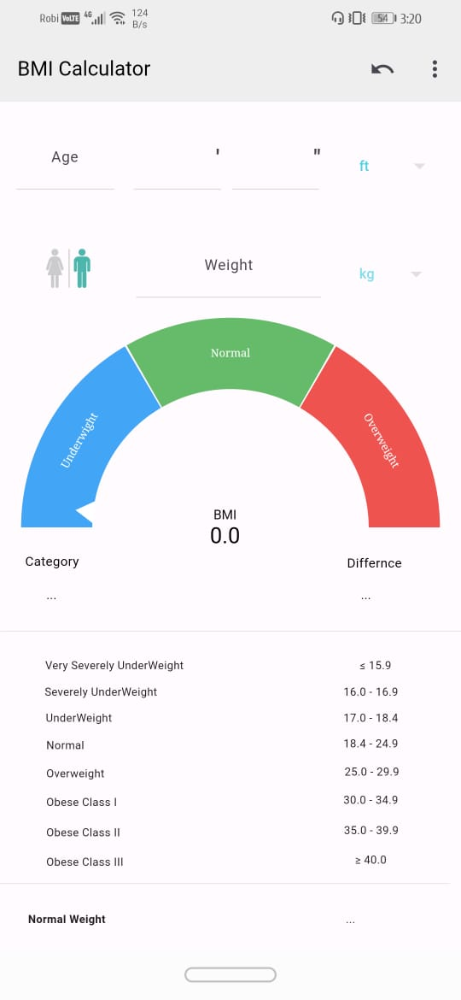
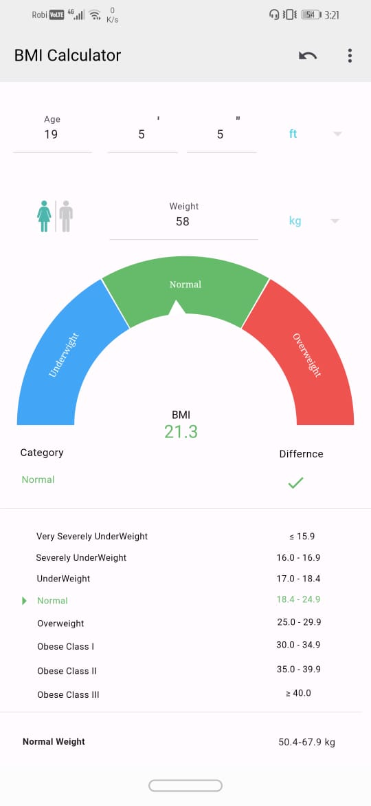
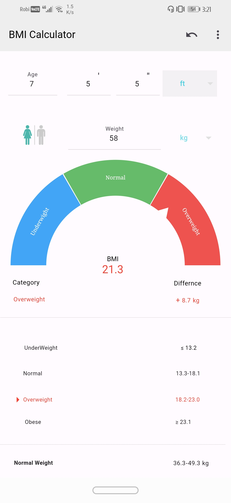
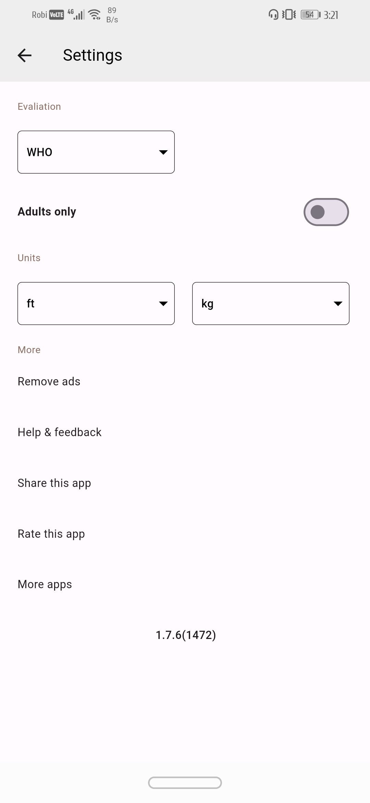
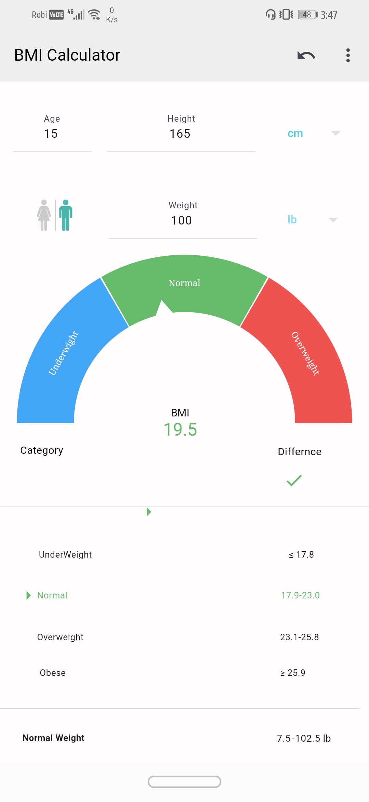

This Flutter project is a faithful  clone of BMI Calculator, a renowned  software widely used in All over the World.This app have more then 10 milions download in Google play store. The aim of this project is to replicate the user interface of BMI for educational purposes and as part of my portfolio. It showcases my skills  mobile app development using Flutter.

## Table of Contents

- [Description](#description)
- [Features](#features)
- [Getting Started](#getting-started)
  - [Prerequisites](#prerequisites)
  - [Installation](#installation)
- [Usage](#usage)
- [Screenshots](#screenshots)
- [Folder Structure](#folder-structure)
- [Contributing](#contributing)
- [License](#license)
- [Acknowledgments](#acknowledgments)

### Description
The  BMI Calculator App is a powerful and user-friendly application built using Flutter. It allows users to calculate their Body Mass Index (BMI) based on their weight and height. The app provides additional features beyond basic BMI calculation, making it a valuable tool for health and fitness enthusiasts.

## Features

- **Precise BMI Calculation** : Utilize an accurate BMI formula to calculate the user’s BMI.
- **Interactive UI** : A visually appealing and intuitive user interface.
- **Customizable Units** : Support both metric (kilograms and meters) and imperial (pounds and inches) units.
- **Health Insights**: Display health recommendations based on the calculated BMI.
- **Graphical Representation** : Visualize BMI trends over time using charts.
### Screenshots
|  |  |  |
|:----------------------:|:----------------------:|:----------------------:
 |  | 

